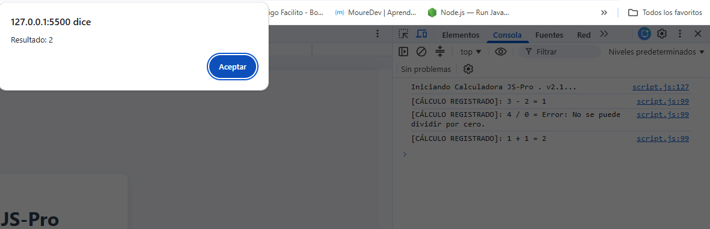
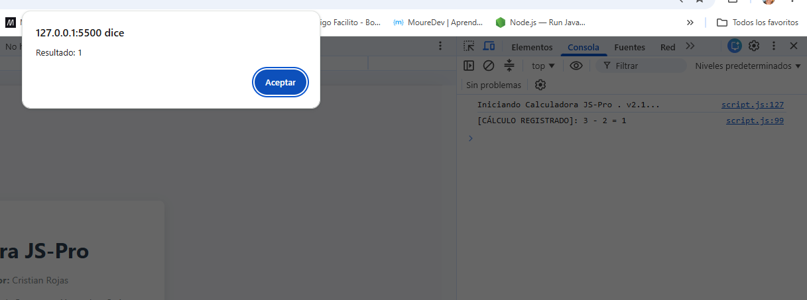
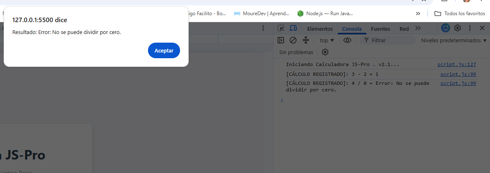

# ABP M3 - Ejercicios

Este repositorio contiene los ejercicios desarrollados para el módulo 3.

## Ejercicios creados (* , / , + , - )

- Archivo principal: `index.html`
- Script: `assets/js/script.js`
- Descripción: solicita al usuario seleccionar que operación matemática básica quiere realizar, por medio de menú en lista.
- Interacción: al hacer clic en el botón **Lanzar Calculadora**, se muestra un `prompt` para ingresar en el menú,soliciando los datos y luego un `alert` con el resultado./Se puede verificar en consola resultados y procedimeintos.

## Archivos del proyecto

- `index.html`: página principal del ejercicio.
- `assets/js/script.js`: lógica de cálculo y validación de la entrada.

## Evidencias

1.- Evenidencia: Resultado de suma:

2.- Evenidencia: Resultado de resta:

2.- Evenidencia: Resultado de división por 0 :

